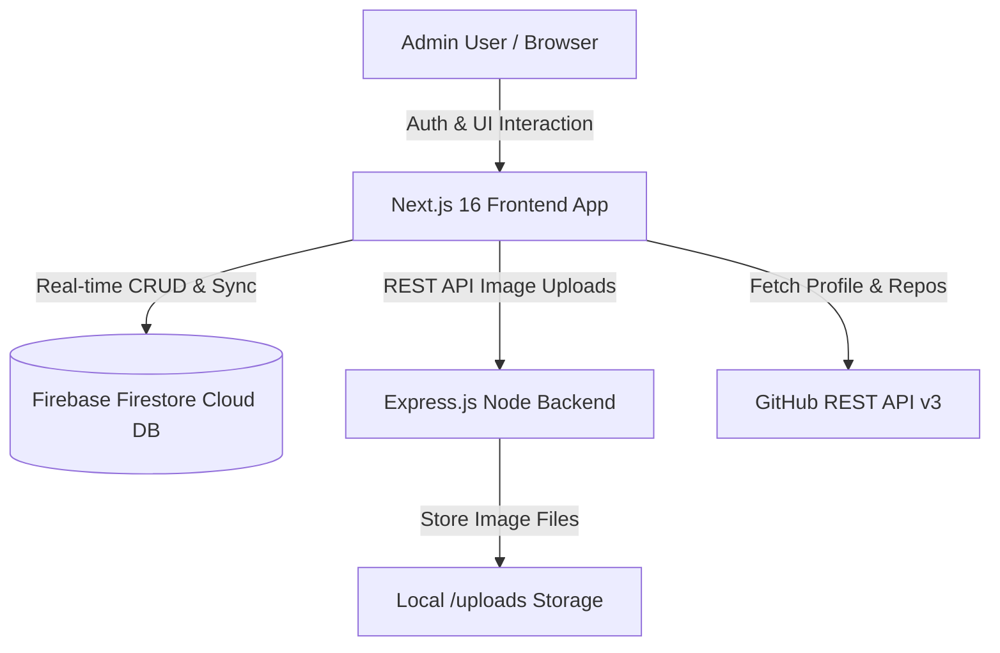

# ⚡ Management Portfolio Admin Dashboard

<div align="center">


**A powerful full-stack administrative dashboard to manage portfolio content, sync GitHub repositories, update technical skill masteries, and handle secure media uploads in real time.**

[Key Features](#-key-features) • [System Architecture](#-system-architecture) • [Tech Stack](#%EF%B8%8F-tech-stack) • [Getting Started](#-getting-started) • [API Documentation](#-api-endpoints) • [Project Structure](#-project-structure)

</div>

---

## 📖 Overview

**Management Portfolio Admin** is an analytical and content management dashboard built for modern developer portfolios. It features a **Next.js 16 (App Router)** frontend with **React 19**, **Firebase Firestore** for real-time cloud data synchronization, and an **Express.js (TypeScript)** backend for secure multipart image uploads with automatic sanitization.

---

## ⚡ Key Features

- **🔐 Passcode Gatekeeper**: Protected administrative authentication modal preventing unauthorized access.
- **📊 Real-Time Analytics & Stats**: Immediate overview of total projects, active skills, public GitHub repositories, and follower counts.
- **📅 GitHub Contribution Calendar**: Integrated visual contribution activity graph powered by `react-github-calendar`.
- **🔄 One-Click GitHub Sync**:
  - **Projects Sync**: Imports public repositories directly into Firestore with auto-generated descriptions and OpenGraph thumbnail previews.
  - **Skills Analysis**: Scans repository language distributions to populate technical skill categories automatically.
- **🛠️ Full CRUD Management**:
  - **Skills Studio**: Create, edit, and delete technical competencies with percentage mastery sliders (0–100%) and acronym badge generators.
  - **Projects Studio**: Manage showcase case studies with custom descriptions, direct live URLs, GitHub source links, and local image uploads.
- **🔍 Global Search (`Ctrl + K` / `Cmd + K`)**: Instant live search filtering across all skills, project titles, and descriptions.
- **🔔 Live Action Notifications**: Activity tracking popover recording recent additions, edits, and GitHub synchronization jobs.
- **🖼️ Express + Multer Upload Server**: Dedicated backend service featuring MIME type verification, 5MB file limits, safe filename generation, and static file hosting.

---

## 📐 System Architecture



---

## 🛠️ Tech Stack

### Frontend Architecture
- **Framework**: [Next.js 16 (App Router)](https://nextjs.org/)
- **UI Library**: [React 19](https://react.dev/)
- **Styling**: [TailwindCSS 3.4](https://tailwindcss.com/)
- **Icons**: [Lucide React](https://lucide.dev/)
- **Cloud Database**: [Firebase Firestore SDK v12](https://firebase.google.com/)
- **Activity Graph**: [react-github-calendar](https://www.npmjs.com/package/react-github-calendar)

### Backend REST API
- **Runtime**: [Node.js](https://nodejs.org/) & [Express.js 4](https://expressjs.com/)
- **Language**: [TypeScript](https://www.typescriptlang.org/) with `ts-node-dev`
- **File Upload Handler**: [Multer](https://github.com/expressjs/multer)
- **Middleware**: `cors`, `dotenv`

---

## 📁 Project Structure

```text
portofolio-admin/
├── backend/                  # Express.js REST API Server
│   ├── src/
│   │   └── server.ts         # Express server & Multer upload handling
│   ├── uploads/              # Stored uploaded project images
│   ├── package.json
│   └── tsconfig.json
├── frontend/                 # Next.js Frontend Web Application
│   ├── public/               # Static assets & fallback icons
│   ├── src/
│   │   ├── app/
│   │   │   ├── globals.css   # TailwindCSS & theme variables
│   │   │   ├── layout.tsx    # Root layout configuration
│   │   │   └── page.tsx      # Main Admin Dashboard page
│   │   ├── components/       # Modular UI Components
│   │   │   ├── Sidebar.tsx
│   │   │   ├── DashboardTab.tsx
│   │   │   ├── SkillsTab.tsx
│   │   │   ├── ProjectsTab.tsx
│   │   │   ├── SkillModal.tsx
│   │   │   ├── ProjectModal.tsx
│   │   │   ├── ConfirmModal.tsx
│   │   │   ├── StatCard.tsx
│   │   │   └── Toast.tsx
│   │   └── lib/
│   │       └── firebase.ts   # Firebase app & Firestore initialization
│   ├── .env.local            # Frontend environment variables
│   ├── package.json
│   └── tsconfig.json
└── README.md
```

---

## 🚀 Getting Started

### Prerequisites
Make sure you have installed:
- **Node.js**: `v18.x` or `v20.x`
- **npm**: `v9.x` or `v10.x`

---

### 1. Clone the Repository
```bash
git clone https://github.com/moch-firmansyahh/management-portofolio--admin-.git
cd management-portofolio--admin-
```

---

### 2. Backend Setup (`/backend`)
```bash
cd backend
npm install
```

Create a `.env` file inside `/backend`:
```env
PORT=3002
BASE_URL=http://localhost:3002
```

Start the Express development server:
```bash
npm run dev
```
> Server runs at `http://localhost:3002`

---

### 3. Frontend Setup (`/frontend`)
Open a new terminal window:
```bash
cd frontend
npm install
```

Ensure `.env.local` inside `/frontend` is configured with your Firebase credentials:
```env
NEXT_PUBLIC_FIREBASE_API_KEY=your_api_key
NEXT_PUBLIC_FIREBASE_AUTH_DOMAIN=your_auth_domain
NEXT_PUBLIC_FIREBASE_PROJECT_ID=your_project_id
NEXT_PUBLIC_FIREBASE_STORAGE_BUCKET=your_storage_bucket
NEXT_PUBLIC_FIREBASE_MESSAGING_SENDER_ID=your_messaging_sender_id
NEXT_PUBLIC_FIREBASE_APP_ID=your_app_id
NEXT_PUBLIC_FIREBASE_MEASUREMENT_ID=your_measurement_id

NEXT_PUBLIC_BACKEND_URL=http://localhost:3002
```

Start the Next.js frontend application:
```bash
npm run dev
```
> App runs at `http://localhost:3000`

---

## 📡 API Endpoints (Backend Server)

| Method | Endpoint | Description | Request Body / Form |
| :--- | :--- | :--- | :--- |
| `GET` | `/` | API status message | None |
| `GET` | `/api/health` | Server health check endpoint | None |
| `GET` | `/api/stats` | Server runtime statistics & storage metrics | None |
| `POST` | `/api/upload` | Upload single project image | Multipart form (`file`: JPG, PNG, WEBP max 5MB) |
| `DELETE` | `/api/upload/:filename` | Delete uploaded project image | None |
| `GET` | `/uploads/:filename` | Serve uploaded static image file | None |

---

## 🔐 Credentials & Default Access

- **Admin Password**: `admin123` *(Configurable in `frontend/src/app/page.tsx`)*

---

## 📄 License

This project is open-source and available under the [MIT License](LICENSE).

<div align="center">
  <sub>Built with ❤️ by <a href="https://github.com/moch-firmansyahh">Moch Firmansyah</a></sub>
</div>
