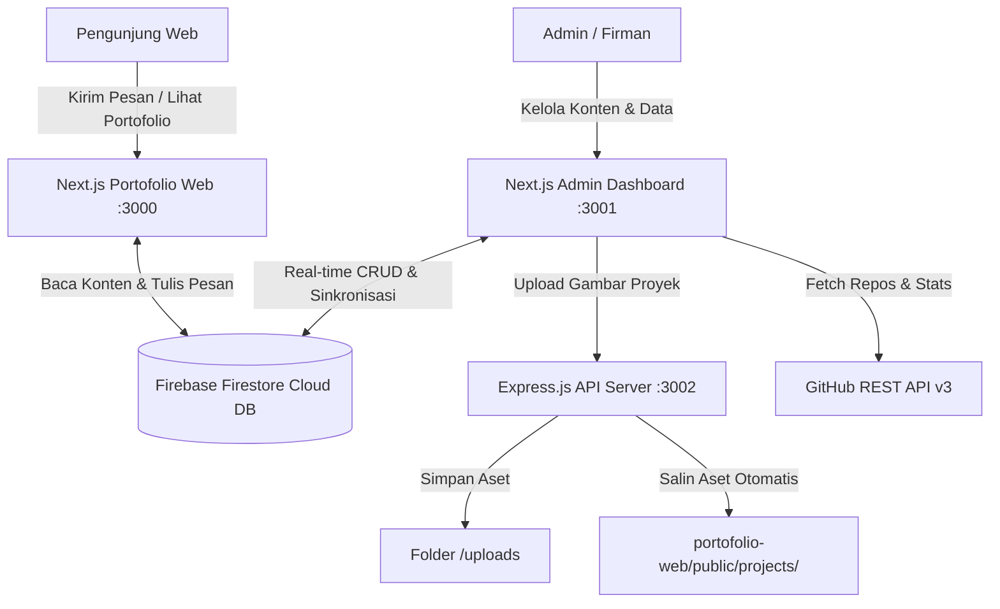

# ⚡ Management Portfolio Admin Dashboard Suite

<div align="center">


[Fitur Utama](#-fitur-utama) • [Arsitektur Sistem](#-arsitektur-sistem) • [Tech Stack](#%EF%B8%8F-tech-stack) • [Struktur Proyek](#-struktur-proyek) • [Panduan Instalasi](#-panduan-instalasi--menjalankan) • [Dokumentasi API](#-dokumentasi-api-backend) • [Kredensial Akses](#-kredensial-akses) • [GitHub](https://github.com/moch-firmansyahh/management-portofolio--admin-)

</div>

---

## 📖 Ringkasan

**Management Portfolio Admin Suite** dirancang untuk memberikan kendali penuh terhadap seluruh elemen dinamis pada website portofolio developer ([`portofolio-web`](https://github.com/moch-firmansyahh/Portofolio-fixed-new)). 

Aplikasi ini menggabungkan antarmuka frontend berbasis **Next.js 16 (App Router)** & **React 19**, penyimpanan cloud real-time **Google Firebase Cloud Firestore**, serta server backend **Express.js (TypeScript)** dengan **Multer** untuk upload file gambar berkinerja tinggi yang tersinkronisasi otomatis antar folder proyek.

---

## ⚡ Fitur Utama

### 1. 📊 Dashboard Analitik & GitHub Overview
- **Statistik Cepat**: Pemantauan real-time total proyek tersimpan, jumlah keahlian aktif, riwayat karier, dan jumlah pesan masuk pengunjung.
- **Profil GitHub Live**: Sinkronisasi foto profil, bio, lokasi, dan statistik repositori publik.
- **GitHub Activity Calendar**: Visualisasi kontribusi GitHub setahun penuh menggunakan `react-github-calendar`.

### 2. 👤 Manajemen Profil & Tentang Saya (`About`)
- **Identitas & Headline**: Atur nama lengkap, nama panggilan, profesi/role utama, dan headline tagline yang tampil di bagian Hero web.
- **Deskripsi Bio**: Editor narasi paragraf tentang latar belakang akademik dan keahlian teknis.
- **Kontak & Sosial Media**: Pengelolaan alamat email, nomor telepon, tautan GitHub, LinkedIn, Instagram, dan TikTok.
- **4 Metrik Statistik**: Pengaturan angka dan label untuk kartu statistik beranda (Tahun Berkarya, Proyek Selesai, Lighthouse Score, dll).

### 3. 🎯 Manajemen Keahlian & Skills (5 Kategori)
- **Kategorisasi Standar**:
  1. `Front-End Web Development`
  2. `Programming Languages`
  3. `Developer Tools`
  4. `Soft Skills & Professional`
  5. `Achievements & Certifications`
- **Pill Filter & Counter Badge**: Filter cepat berdasarkan kategori dengan badge jumlah skill aktif.
- **Dukungan Kategori Kustom**: Tombol `+ Kategori Baru` untuk membuat kategori baru secara fleksibel.
- **Impor Sertifikasi Resmi**: Tombol satu klik untuk menyinkronkan seluruh 16 sertifikasi Google AI & Network Security ke Firestore.
- **Sinkronisasi Bahasa GitHub**: Deteksi otomatis bahasa pemrograman dari repositori GitHub publik.

### 4. 💼 Manajemen Proyek & Portofolio (`Projects`)
- **Operasi CRUD Lengkap**: Tambah, edit, dan hapus proyek dengan status featured, kategori, tahun, dan sorotan teknis (*highlights*).
- **Upload Gambar Cover**: Didukung server Express + Multer dengan preview instan dan proteksi format (JPG, PNG, WEBP, GIF, SVG maks 15 MB).
- **Sinkronisasi Otomatis Aset**: Gambar yang diunggah otomatis tersedia di direktori publik website portofolio.
- **Impor Proyek Bawaan**: Tombol satu klik untuk memuat proyek unggulan asli web (Kontrakan Pa Iman & Voluntrip).

### 5. 🎓 Manajemen Riwayat Pengalaman (`Experience`)
- **Timeline Karier & Pendidikan**: Manajemen riwayat kerja, magang, dan studi grup organisasi.
- **Metadata Lengkap**: Periode waktu, peran/posisi, nama instansi/perusahaan, lokasi, deskripsi tugas, dan tags teknologi yang digunakan.
- **Impor Riwayat Bawaan**: Tombol untuk memuat data pengalaman historis ke timeline web.

### 6. 📬 Inbox Pesan Masuk Pengunjung (`Messages`)
- **Penerimaan Pesan Real-Time**: Pesan yang dikirim pengunjung melalui form kontak website langsung masuk ke dashboard admin.
- **Indikator Unread**: Badge notifikasi denyut biru di sidebar dan bell header saat ada pesan baru.
- **Pembaca Pesan Detail**: Modal membaca isi pesan, subjek, identitas pengirim, dan tanggal masuk.
- **Balas Cepat (Mailto)**: Tombol untuk langsung membalas pesan ke email pengirim melalui aplikasi email default.
- **Manajemen Status**: Tombol tandai sudah/belum dibaca dan hapus pesan permanen.

### 7. 🚀 Optimasi & UX
- **Zero-Lag Modal Overlay**: Animasi pop-up berbasis GPU yang ringan dan responsif tanpa lag.
- **Global Search (`Ctrl + K`)**: Pencarian instan melintasi data proyek, skill, dan pesan.
- **Sistem Konfirmasi Aman**: Modal dialog konfirmasi sebelum melakukan aksi hapus data penting.

---

## 📐 Arsitektur Sistem



---

## 🛠️ Tech Stack

### Frontend Dashboard
- **Framework**: [Next.js 16 (App Router)](https://nextjs.org/) & [React 19](https://react.dev/)
- **Styling**: [TailwindCSS 3.4](https://tailwindcss.com/)
- **Icons**: [Lucide React](https://lucide.dev/)
- **Database Client**: [Firebase Firestore SDK v12](https://firebase.google.com/)
- **Activity Calendar**: [react-github-calendar](https://www.npmjs.com/package/react-github-calendar)

### Backend API Server
- **Runtime**: [Node.js](https://nodejs.org/) & [Express.js 4](https://expressjs.com/)
- **Language**: [TypeScript](https://www.typescriptlang.org/) dengan `ts-node-dev`
- **File Upload Handler**: [Multer](https://github.com/expressjs/multer) (Multi-field support)
- **Utilities**: `cors`, `dotenv`

---

## 📁 Struktur Proyek

```text
portofolio-admin/
├── backend/                  # Server REST API Upload & Servis File
│   ├── src/
│   │   └── server.ts         # Server Express & endpoint upload Multer
│   ├── uploads/              # Penyimpanan lokal file upload
│   ├── package.json
│   └── tsconfig.json
├── frontend/                 # Aplikasi Next.js Admin Dashboard
│   ├── public/               # Aset publik & preview gambar proyek
│   ├── src/
│   │   ├── app/
│   │   │   ├── globals.css   # Variabel tema, animasi modal GPU, & Tailwind
│   │   │   ├── layout.tsx    # Root layout aplikasi
│   │   │   └── page.tsx      # Entry point controller dashboard admin
│   │   ├── components/       # Modul UI CMS
│   │   │   ├── Sidebar.tsx           # Navigasi & badge unread inbox
│   │   │   ├── DashboardTab.tsx      # Analisis ringkasan & kalender GitHub
│   │   │   ├── AboutTab.tsx          # Form profil, bio, & 4 kartu metrik
│   │   │   ├── SkillsTab.tsx         # Manajemen keahlian 5 kategori
│   │   │   ├── SkillModal.tsx        # Modal tambah/edit skill & kategori kustom
│   │   │   ├── ProjectsTab.tsx       # Manajemen proyek & portofolio
│   │   │   ├── ProjectModal.tsx      # Modal proyek & uploader cover
│   │   │   ├── ExperienceTab.tsx     # Tabel riwayat pengalaman karier
│   │   │   ├── ExperienceModal.tsx   # Modal riwayat karier
│   │   │   ├── MessagesTab.tsx       # Inbox pesan masuk pengunjung web
│   │   │   ├── MessageModal.tsx      # Modal detail baca pesan & balas
│   │   │   ├── ConfirmModal.tsx      # Dialog konfirmasi aksi berbahaya
│   │   │   ├── StatCard.tsx          # Kartu statistik ringkasan
│   │   │   └── Toast.tsx             # Pop-up notifikasi status aksi
│   │   └── lib/
│   │       └── firebase.ts   # Inisialisasi Firebase App & Firestore
│   ├── .env.local            # Kredensial Firebase & URL Backend
│   ├── package.json
│   └── tsconfig.json
├── .gitignore
└── README.md
```

---

## 🚀 Panduan Instalasi & Menjalankan

### Kebutuhan Sistem:
- **Node.js**: `v18.x` atau `v20.x`
- **npm**: `v9.x` atau `v10.x`

---

### 1. Clone Repositori
```bash
git clone https://github.com/moch-firmansyahh/management-portofolio--admin-.git
cd management-portofolio--admin-
```

---

### 2. Konfigurasi Backend Server (`/backend`)
```bash
cd backend
npm install
```

Buat file `.env` di dalam folder `backend`:
```env
PORT=3002
BASE_URL=http://localhost:3002
```

Jalankan server backend:
```bash
npm run dev
```
> Server backend aktif di: **`http://localhost:3002`**

---

### 3. Konfigurasi Frontend Admin (`/frontend`)
Buka jendela terminal baru:
```bash
cd frontend
npm install
```

Pastikan file `.env.local` di dalam folder `frontend` telah memuat konfigurasi Firebase Firestore Anda:
```env
NEXT_PUBLIC_FIREBASE_API_KEY=your_api_key
NEXT_PUBLIC_FIREBASE_AUTH_DOMAIN=your_auth_domain
NEXT_PUBLIC_FIREBASE_PROJECT_ID=your_project_id
NEXT_PUBLIC_FIREBASE_STORAGE_BUCKET=your_storage_bucket
NEXT_PUBLIC_FIREBASE_MESSAGING_SENDER_ID=your_messaging_sender_id
NEXT_PUBLIC_FIREBASE_APP_ID=your_app_id
NEXT_PUBLIC_FIREBASE_MEASUREMENT_ID=your_measurement_id

NEXT_PUBLIC_BACKEND_URL=http://localhost:3002
```

Jalankan dashboard admin:
```bash
npm run dev
```
> Dashboard admin otomatis aktif di: **`http://localhost:3001`** *(port 3001 telah terkonfigurasi di `package.json` agar tidak bentrok dengan portofolio web di port 3000)*.

---

## 📡 Dokumentasi API Backend

| Metode | Endpoint | Deskripsi | Format Request Body |
| :--- | :--- | :--- | :--- |
| `GET` | `/` | Informasi status API server | Tidak ada |
| `GET` | `/api/health` | Pemeriksaan kesehatan server (*health check*) | Tidak ada |
| `GET` | `/api/stats` | Informasi statistik runtime & total ukuran penyimpanan upload | Tidak ada |
| `POST` | `/api/upload` | Mengunggah gambar cover proyek | Multipart form (`file` / `image`: JPG, PNG, WEBP maks 15 MB) |
| `DELETE` | `/api/upload/:filename` | Menghapus file gambar yang telah diunggah | Tidak ada |
| `GET` | `/uploads/:filename` | Menyajikan file gambar statis publik | Tidak ada |

---

## 🔐 Kredensial Akses

- **Password Masuk Admin**: `admin123` *(dapat disesuaikan pada `frontend/src/app/page.tsx`)*

---

## 📄 Lisensi

Proyek ini bersifat sumber terbuka di bawah lisensi [MIT License](LICENSE).

<div align="center">
  <sub>Dibuat dengan ❤️ oleh <a href="https://github.com/moch-firmansyahh">Moch. Firmansyah</a> • © 2025 - 2026</sub>
</div>
