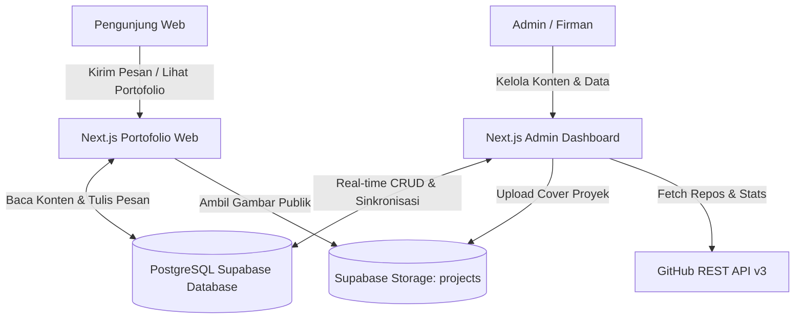

# ⚡ Management Portfolio Admin Dashboard Suite

<div align="center">


[Fitur Utama](#-fitur-utama) • [Arsitektur Sistem](#-arsitektur-sistem) • [Tech Stack](#%EF%B8%8F-tech-stack) • [Struktur Proyek](#-struktur-proyek) • [Panduan Instalasi](#-panduan-instalasi--menjalankan) • [Kredensial Akses](#-kredensial-akses) • [GitHub](https://github.com/moch-firmansyahh/management-portofolio--admin-)

</div>

---

## 📖 Ringkasan

**Management Portfolio Admin Suite** dirancang untuk memberikan kendali penuh terhadap seluruh elemen dinamis pada website portofolio developer ([`portofolio-web`](https://github.com/moch-firmansyahh/Portofolio-fixed-new)). 

Aplikasi ini menggabungkan antarmuka frontend modern berbasis **Next.js 16 (App Router)** & **React 19**, penyimpanan cloud database **PostgreSQL Supabase**, serta **Supabase Storage** untuk upload gambar cover proyek secara serverless tanpa memerlukan server backend tambahan.

---

## ⚡ Fitur Utama

### 1. 📊 Dashboard Analitik & GitHub Overview
- **Statistik Cepat**: Pemantauan real-time total proyek tersimpan, jumlah keahlian aktif, riwayat karier, dan jumlah pesan masuk pengunjung.
- **Profil GitHub Live**: Sinkronisasi foto profil, bio, lokasi, dan statistik repositori publik.
- **GitHub Activity Calendar**: Visualisasi kontribusi GitHub setahun penuh menggunakan `react-github-calendar`.
- **Latency Checker**: Pemeriksaan konektivitas real-time langsung ke Supabase Cloud.

### 2. 👤 Manajemen Profil & Tentang Saya (`About`)
- **Identitas & Headline**: Atur nama lengkap, nama panggilan, profesi/role utama, dan headline tagline yang tampil di bagian Hero web.
- **Deskripsi Bio**: Editor narasi paragraf tentang latar belakang akademik dan keahlian teknis.
- **Kontak & Sosial Media**: Pengelolaan alamat email, nomor telepon, tautan GitHub, LinkedIn, Instagram, dan TikTok.
- **4 Metrik Statistik**: Pengaturan angka dan label untuk kartu statistik beranda (Tahun Berkarya, Proyek Selesai, Lighthouse Score, dll).

### 3. 🎯 Manajemen Keahlian & Skills (5 Kategori)
- **Kategorisasi Standar**:
  1. `Front-End Web Development`
  2. `Programming Languages`
  3. `Developer Tools`
  4. `Soft Skills & Professional`
  5. `Achievements & Certifications`
- **Pill Filter & Counter Badge**: Filter cepat berdasarkan kategori dengan badge jumlah skill aktif.
- **Dukungan Kategori Kustom**: Tombol `+ Kategori Baru` untuk membuat kategori baru secara fleksibel.
- **Impor Sertifikasi Resmi**: Tombol satu klik untuk menyinkronkan seluruh 16 sertifikasi Google AI & Network Security ke Supabase.
- **Sinkronisasi Bahasa GitHub**: Deteksi otomatis bahasa pemrograman dari repositori GitHub publik.

### 4. 💼 Manajemen Proyek & Portofolio (`Projects`)
- **Operasi CRUD Lengkap**: Tambah, edit, dan hapus proyek dengan status featured, kategori, tahun, dan sorotan teknis (*highlights*).
- **Upload Cover Proyek**: Menggunakan **Supabase Storage Bucket (`projects`)** dengan preview instan dan link CDN publik.
- **Impor Proyek Bawaan**: Tombol satu klik untuk memuat proyek unggulan asli web (Kontrakan Pa Iman & Voluntrip).

### 5. 🎓 Manajemen Riwayat Pengalaman (`Experience`)
- **Timeline Karier & Pendidikan**: Manajemen riwayat kerja, magang, dan studi grup organisasi.
- **Metadata Lengkap**: Periode waktu, peran/posisi, nama instansi/perusahaan, lokasi, deskripsi tugas, dan tags teknologi yang digunakan.
- **Impor Riwayat Bawaan**: Tombol untuk memuat data pengalaman historis ke timeline web.

### 6. 📬 Inbox Pesan Masuk Pengunjung (`Messages`)
- **Penerimaan Pesan Real-Time**: Pesan yang dikirim pengunjung melalui form kontak website langsung masuk ke dashboard admin.
- **Indikator Unread**: Badge notifikasi denyut biru di sidebar saat ada pesan baru.
- **Pembaca Pesan Detail**: Modal membaca isi pesan, subjek, identitas pengirim, dan tanggal masuk.
- **Balas Cepat (Mailto)**: Tombol untuk langsung membalas pesan ke email pengirim.
- **Manajemen Status**: Tombol tandai sudah/belum dibaca dan hapus pesan permanen.

### 7. 🚀 Optimasi & UX
- **Zero-Lag Modal Overlay**: Animasi pop-up berbasis GPU yang ringan dan responsif tanpa lag.
- **Global Search (`Ctrl + K`)**: Pencarian instan melintasi data proyek, skill, dan pesan.
- **Sistem Konfirmasi Aman**: Modal dialog konfirmasi sebelum melakukan aksi hapus data penting.

---

## 📐 Arsitektur Sistem



---

## 🛠️ Tech Stack

### Frontend Dashboard
- **Framework**: [Next.js 16 (App Router)](https://nextjs.org/) & [React 19](https://react.dev/)
- **Styling**: [TailwindCSS 3.4](https://tailwindcss.com/)
- **Icons**: [Lucide React](https://lucide.dev/)
- **Database & Storage Client**: [@supabase/supabase-js](https://supabase.com/)
- **Activity Calendar**: [react-github-calendar](https://www.npmjs.com/package/react-github-calendar)

---

## 📁 Struktur Proyek

```text
portofolio-admin/
├── frontend/                 # Aplikasi Next.js Admin Dashboard
│   ├── public/               # Aset gambar & proyek
│   ├── src/
│   │   ├── app/
│   │   │   ├── globals.css   # Tema Tailwind & animasi dialog
│   │   │   ├── layout.tsx    # Root layout aplikasi
│   │   │   └── page.tsx      # Entry point controller dashboard admin
│   │   ├── components/       # Komponen modular UI Admin
│   │   │   ├── Sidebar.tsx           # Navigasi & badge unread inbox
│   │   │   ├── DashboardTab.tsx      # Ringkasan analitik & kalender GitHub
│   │   │   ├── AboutTab.tsx          # Form profil, bio, & 4 kartu metrik
│   │   │   ├── SkillsTab.tsx         # Manajemen keahlian 5 kategori
│   │   │   ├── SkillModal.tsx        # Modal tambah/edit skill
│   │   │   ├── ProjectsTab.tsx       # Manajemen katalog proyek
│   │   │   ├── ProjectModal.tsx      # Modal proyek & upload cover
│   │   │   ├── ExperienceTab.tsx     # Tabel riwayat karier/pendidikan
│   │   │   ├── ExperienceModal.tsx   # Modal riwayat karier
│   │   │   ├── MessagesTab.tsx       # Inbox pesan masuk pengunjung
│   │   │   ├── MessageModal.tsx      # Modal detail baca pesan & balas
│   │   │   ├── ConfirmModal.tsx      # Dialog konfirmasi aksi hapus
│   │   │   ├── StatCard.tsx          # Kartu statistik metrik
│   │   │   └── Toast.tsx             # Notifikasi toast status aksi
│   │   └── lib/
│   │       └── supabase.ts   # Inisialisasi Supabase client
│   ├── .env.local            # Kredensial Supabase
│   ├── package.json
│   └── tsconfig.json
├── .gitignore
└── README.md
```

---

## 🚀 Panduan Instalasi & Menjalankan

### Kebutuhan Sistem:
- **Node.js**: `v18.x` atau `v20.x`
- **npm**: `v9.x` atau `v10.x`

---

### 1. Clone Repositori
```bash
git clone https://github.com/moch-firmansyahh/management-portofolio--admin-.git
cd management-portofolio--admin-
```

---

### 2. Jalankan Dashboard Admin (`/frontend`)
```bash
cd frontend
npm install
```

Pastikan file `.env.local` di dalam folder `frontend` telah memuat konfigurasi Supabase Anda:
```env
NEXT_PUBLIC_SUPABASE_URL=https://cgnerlwoezzjqaqofzuy.supabase.co
NEXT_PUBLIC_SUPABASE_ANON_KEY=sb_publishable_8B0fFkdbM16eYuHmBz5FPQ_LGvHKBha
```

Jalankan server development:
```bash
npm run dev
```
> Dashboard admin otomatis aktif di: **`http://localhost:3001`** *(port 3001 dikonfigurasi agar tidak bentrok dengan web portofolio di port 3000)*.

---

## 🔐 Kredensial Akses

- **Password Masuk Admin**: `firman2026` atau `admin123` *(dapat disesuaikan pada `frontend/src/app/page.tsx`)*

---

## 📄 Lisensi

Proyek ini bersifat sumber terbuka di bawah lisensi [MIT License](LICENSE).

<div align="center">
  <sub>Dibuat dengan ❤️ oleh <a href="https://github.com/moch-firmansyahh">Moch. Firmansyah</a> • © 2025 - 2026</sub>
</div>
